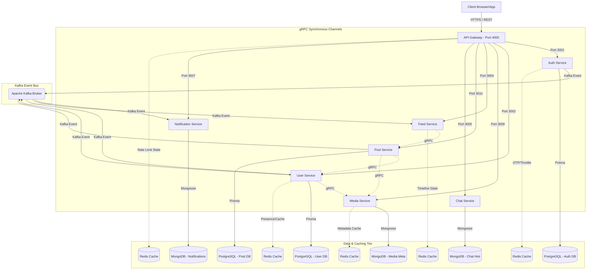

# Waave Microservice Platform

Waave is an enterprise-grade, production-minded NestJS microservices platform. It is built around clean domain boundaries, high-performance synchronous gRPC communication, asynchronous event-driven Kafka messaging, and multi-tier caching via Redis.

---

## 📖 Table of Contents
1. [Platform Architecture](#1-platform-architecture)
2. [Project Structure Layout](#2-project-structure-layout)
3. [Service Catalog & Ports Matrix](#3-service-catalog--ports-matrix)
4. [In-Depth Service Specifications](#4-in-depth-service-specifications)
    - [API Gateway](#api-gateway-appsapi-gateway)
    - [Auth Service](#auth-service-appsauth-service)
    - [User Service](#user-service-appsuser-service)
    - [Media Service](#media-service-appsmedia-service)
    - [Feed Service](#feed-service-appsfeed-service)
    - [Post Service](#post-service-appspost-service)
    - [Chat Service](#chat-service-appschat-service)
    - [Notification Service](#notification-service-appsnotification)
5. [Shared Library Specifications](#5-shared-library-specifications)
    - [Clients Library (`libs/clients`)](#clients-library-libsclients)
    - [Common Library (`libs/common`)](#common-library-libscommon)
    - [Kafka Library (`libs/kafka`)](#kafka-library-libskafka)
    - [Proto-Schema Library (`libs/proto-schema`)](#proto-schema-library-libsproto-schema)
6. [Local Environment Setup](#6-local-environment-setup)
7. [Operational & Security Architecture](#7-operational--security-architecture)

---

## 1. Platform Architecture

The Waave architecture balances immediate response pathing with eventual consistency through a combination of sync/async internal messaging:



### Core Communication Architecture
- **gRPC (Sync)**: Used for interactions requiring instant verification or blocking data return. Examples include authorization token verification, profile details lookup, and media processing status reviews.
- **Kafka (Async)**: Decoupled events stream. Used for operations that can be resolved eventually, reducing response lag on core HTTP endpoints. For example, profile generation on signup, timeline rebuilds on post creation, and transactional email distribution.

---

## 2. Project Structure Layout

This repository is organized as a monorepo containing application workspaces (`apps/`) and reusable modular utilities (`libs/`):

```text
Waave/
├── apps/
│   ├── api-gateway/            # REST Frontdoor and Orchestration layer
│   ├── auth-service/           # Identity Provider and Token Manager
│   ├── feed-service/           # Timeline Aggregation and Trending Scoring
│   ├── media-service/          # Media asset metadata and variant conversion
│   ├── notification/           # Message-driven outbound mail/delivery & in-app alerts
│   ├── post-service/           # Post creation and cron-scheduled publisher
│   └── chat-service/           # Real-time workspace chat messages & group server
├── libs/
│   ├── clients/                # Unifies and exposes gRPC clients (User, Post, Media)
│   ├── common/                 # Global validation filters, inter-service guards, and decorators
│   ├── kafka/                  # Kafka module wrap and generic event providers
│   └── proto-schema/           # Protocol Buffers (*.proto) and generated TS interfaces
├── storage/                    # Local directory target representing image and media assets
│   ├── avatars/                # Scaled profile avatar storage folder
│   ├── covers/                 # Cover photo variant directory
│   ├── images/                 # Post image asset folder
│   ├── videos/                 # Video upload storage directory
│   └── temp/                   # Temporary cache of uploaded file streams
├── docker-compose.yaml         # Multi-container cluster (PostgreSQL, MongoDB, Kafka, Redis)
├── package.json                # Custom workspace run-scripts and engine drivers
└── tsconfig.json               # Global compiler configuration
```

---

## 3. Service Catalog & Ports Matrix

The platform functions using the following defaults, customizable via workspace environment configurations:

| Service Name | Primary Protocol | Port Config | Backing Database | Caching Strategy | Key Directories |
| :--- | :---: | :---: | :--- | :--- | :--- |
| **API Gateway** | HTTP/REST | `4000` | None | Redis (`RedisGW`) | [`apps/api-gateway`](file:///Users/macbookair/Desktop/code/dream-project/my-product/apps/api-gateway) |
| **Auth Service** | gRPC / HTTP | `3001` / `4001` | PostgreSQL (`PostgresAuth`) | Redis (`RedisAuth`) | [`apps/auth-service`](file:///Users/macbookair/Desktop/code/dream-project/my-product/apps/auth-service) |
| **User Service** | gRPC / HTTP | `3002` / `4002` | PostgreSQL (`PostgresUser`) | Redis (`RedisUser`) | [`apps/user-service`](file:///Users/macbookair/Desktop/code/dream-project/my-product/apps/user-service) |
| **Media Service** | gRPC / HTTP | `3009` / `4009` | MongoDB | Redis (`RedisMedia`) | [`apps/media-service`](file:///Users/macbookair/Desktop/code/dream-project/my-product/apps/media-service) |
| **Feed Service** | gRPC / HTTP | `3004` / `4004` | None | Redis (`RedisFeed`) | [`apps/feed-service`](file:///Users/macbookair/Desktop/code/dream-project/my-product/apps/feed-service) |
| **Post Service** | gRPC / HTTP | `3011` / `4011` | PostgreSQL (`PostgresPost`) | Redis | [`apps/post-service`](file:///Users/macbookair/Desktop/code/dream-project/my-product/apps/post-service) |
| **Chat Service** | gRPC / HTTP | `3005` / `4005` | MongoDB (`MongoDBChat`) | Redis | [`apps/chat-service`](file:///Users/macbookair/Desktop/code/dream-project/my-product/apps/chat-service) |
| **Notification** | gRPC / HTTP / WS | `3007` / `4010` | MongoDB (`MongoDBNotif`) | Redis | [`apps/notification`](file:///Users/macbookair/Desktop/code/dream-project/my-product/apps/notification) |

---

## 4. In-Depth Service Specifications

### API Gateway (`apps/api-gateway`)

The ingress point of all client-side REST services. It routes public requests and translates them into appropriate internal communications.

#### Responsibilities & Operations
- **Request Routing**: Exposes REST interfaces and translates them to gRPC downstream.
- **Form Validation**: Filters payload patterns and ensures data structures align with expectations.
- **Documentation**: Collects all route controllers and exhibits interactive Swagger documentation.
- **Throttling**: Leverages Redis rate limits to protect endpoints (like registration and login).

#### Key Environment Configurations
- `API_GATEWAY_HTTP_PORT` (Default: `4000`)
- `AUTH_SERVICE_GRPC_URL` (Default: `localhost:3001`)
- `USER_SERVICE_GRPC_URL` (Default: `localhost:3002`)
- `MEDIA_SERVICE_GRPC_URL` (Default: `localhost:3009`)
- `API_GATEWAY_REDIS_HOST` & `API_GATEWAY_REDIS_PORT`
- `JWT_ACCESS_SECRET`

#### Workspace Setup
- `src/auth/` – Controllers handling auth endpoints and auth RPC clients.
- `src/user/` – Controllers managing profile and follow inputs.
- `src/media/` – Controller processing image and media upload streams.
- `src/rateLimit/` – Rate limit guards, throttling timers, and Redis connectors.

---

### Auth Service (`apps/auth-service`)

The Identity Provider for the platform. It manages user logins, passwords, email OTP validations, and token renewals.

#### Registration & Sign In Lifecycle
1. Gateway receives registration REST payloads and calls Auth Service over gRPC.
2. Checking database existence, it hashes passwords and writes a verified status record to PostgreSQL.
3. Generates verification OTP records in Redis and emits events to Kafka.
4. User logs in, credential check processes, JWT tokens generate, and active refresh hashes save to PostgreSQL.

#### Datastore Specification (PostgreSQL - SQLite/Prisma)
Defines structural account columns under Model `users`:

| Field Name | Data Type | Key Type | Purpose / Description |
| :--- | :--- | :---: | :--- |
| `id` | `String` | **Primary Key** | UUID representation string |
| `name` | `String` | - | User display name |
| `email` | `String` | **Unique Index**| Email address lookup index |
| `password` | `String` | - | bcrypt password hash |
| `role` | `enum` | - | Account access: `USER`, `ADMIN`, `MODERATOR` |
| `isVerified` | `Boolean` | - | Legacy approval status |
| `refreshToken` | `String?` | - | Hashed token identifier |
| `isEmailVerified`| `Boolean` | - | Current verification indicator |
| `createdAt` | `DateTime` | - | Original insertion timestamp |
| `updatedAt` | `DateTime` | - | Modification timestamp |

#### Kafka Broker Pipelines
- **Emitted events**:
  - `user.registered`: Informs User Service to initialize profile records.
  - `user.send-registration-otp`: Dispatched to trigger OTP emails.
  - `user.login`: Signals active sign-in sessions for analytics.
  - `user.forgot-pass-request`: Dispatched to process password reset emails.

#### Key Environment Configurations
- `AUTH_GRPC_PORT` (Default: `3001`)
- `AUTH_HTTP_PORT` (Default: `4001`)
- `AUTH_DB_PRIMARY_URL` (PostgreSQL target connection string)
- `AUTH_REDIS_HOST` & `AUTH_REDIS_PORT`
- `JWT_ACCESS_SECRET` & `JWT_REFRESH_SECRET`

---

### User Service (`apps/user-service`)

Governs user profile configuration details, social relationship tracking (follows), search listings, and active status presence indicators.

#### Core Capacities
- **Profile operations**: Processes database changes for biographic descriptions, matching avatars, and header files.
- **Social graph**: Connects profiles via follow links and compiles listing grids.
- **Presence checks**: Tracks active user status using temporary Redis storage keys.
- **Self-Enrichment**: Resolves `avatarMediaId` and `coverMediaId` references inside the service using `MediaGrpcClient` to return nested `UserMedia` objects instead of raw strings.

#### Datastore Specification (PostgreSQL - SQLite/Prisma)
The service operates two main structures:

##### `profiles` Model Fields
- `id` (Matches Auth UUID - Primary key)
- `email` (Indexed profile account identifier)
- `name` (Display name string)
- `bio` (Biographical summary)
- `avatarMediaId` & `coverMediaId` (Reference IDs locating assets in the Media Service)
- `location` / `website` / `birthDate` (Metadata values)
- `followersCount` / `followingCount` / `postsCount` (Indexed values)

##### `follows` Model Fields
- `id` (Relations record index)
- `followerId` (Follower profile UUID reference)
- `followingId` (Followed profile UUID reference)
- `createdAt` (Connection timestamp)
- *Enforces a unique constraint pair: `(followerId, followingId)`.*

#### Caching & Presence Design
- Cached profile outputs are stored in Redis (`user:profile:{userId}`).
- Active online markers are registered via Redis TTL checks. For example, `user:presence:{userId} = "online"` (expiring within 5 minutes).

#### Key Environment Configurations
- `USER_GRPC_PORT` (Default: `3002`)
- `USER_HTTP_PORT` (Default: `4002`)
- `USER_DB_PRIMARY_URL` (Connection string)
- `USER_REDIS_HOST` & `USER_REDIS_PORT`
- `MEDIA_GRPC_PORT` (Enriches profiles with avatar metadata)

---

### Media Service (`apps/media-service`)

Manages media storage processes, variant conversions (like resizing images for thumbnail and medium sizes), and media search indexes.

#### Processing Steps
1. Client pushes asset bytes via the API Gateway.
2. Gateway writes bytes to `storage/temp/` and calls the Media Service over gRPC.
3. Media Service moves files into storage buckets (`storage/images/`, etc.).
4. For image assets, resizing variants (`thumbnail` and `medium`) are automatically generated.
5. Saves asset schema parameters to MongoDB and triggers lookup states.

#### Database Strategy (MongoDB - Mongoose Schema)
Asset metrics are stored in the `media` collection:
- `userId` (Asset owner identifier string)
- `type` (Media configuration type: `image`, `video`, etc.)
- `originalUrl` / `thumbnailUrl` / `mediumUrl` (Stored variant URLs)
- `mimeType` / `size` (File metadata sizes)
- `status` (Processing state: `pending`, `processing`, `done`, `failed`)
- `width` / `height` / `duration` (Dimensions and audio/video metric details)

#### Key Environment Configurations
- `MEDIA_GRPC_PORT` (Default: `3009`)
- `MEDIA_HTTP_PORT` (Default: `4009`)
- `MEDIA_MONGO_DB_URL` (MongoDB target connection string)

---

### Feed Service (`apps/feed-service`)

Manages timelines, global trending indexes, page pagination, and caching strategies.

#### Performance Architecture
The Feed Service does not have a permanent DB. It relies on Redis data structures to serve timelines:
- **User Timelines (`feed:{userId}`)**: A Redis list storing active post IDs for followed users.
- **Trending Index (`trending:posts:global`)**: A Redis Sorted Set sorting global post IDs by engagement scores.
- **Clean Enrichment**: It does not make direct round-trips to the `user` or `media` services. It maps the pre-resolved `author` (User) and `media` (repeated Media) objects directly returned from `post-service`.

#### Kafka Subscriptions
Listens to Kafka events to update feeds and invalidate caches:
- `post.created` / `post.deleted` (Updates timelines and invalidates feed page caches)
- `post.liked` / `post.commented` / `post.shared` (Recalculates trending scores)
- `user.profile-followed` / `user.profile-unfollowed` (Updates user timeline caches)

#### Key Environment Configurations
- `FEED_GRPC_PORT` (Default: `3004`)
- `FEED_HTTP_PORT` (Default: `4004`)
- `FEED_REDIS_HOST` & `FEED_REDIS_PORT`
- `POST_SERVICE_GRPC_URL`

---

### Post Service (`apps/post-service`)

Manages post creations, soft deletions, content schedules, and post revision histories.

#### Key Structures (PostgreSQL - SQLite/Prisma)
Governs post records under Model `posts`:
- `id` (Post unique identifier)
- `authorId` (Author account UUID reference)
- `content` (Post textual content string)
- `mediaRefs` (Array of media asset UUIDs)
- `visibility` (Content access scope: `PUBLIC`, `FOLLOWERS`, `PRIVATE`)
- `status` (Publication status: `DRAFT`, `SCHEDULED`, `PUBLISHED`)
- **Self-Enrichment**: Resolves `author` profiles and `media` details inside the service level using `UserGrpcClient` and `MediaGrpcClient`, ensuring callers receive nested schemas.

#### Key Environment Configurations
- `POST_GRPC_PORT` (Default: `3011`)
- `POST_HTTP_PORT` (Default: `4011`)
- `POST_DB_URL` (PostgreSQL target connection string)
- `POST_REDIS_HOST` & `POST_REDIS_PORT`

---

### Chat Service (`apps/chat-service`)

Dual REST/WebSocket engine that powers real-time messaging, group chat management, read check updates, and emoji reactions.

#### Messaging Flow
1. Client connects via Socket.io sending authorization header details.
2. Messages emit on the `sendMessage` channel.
3. Message parameters are saved to MongoDB.
4. Messages are broadcasted in real-time to active receiver client sockets.

#### Database Strategy (MongoDB - Mongoose Schema)
- **`conversations` collection**: tracks participants, admins, group avatars, matching last messages, and unread counts.
- **`messages` collection**: tracks message texts, attachment lists, read states, and emoji reactions. Returns data aligned to nested `sender` and `media` schemas.

#### Key Environment Configurations
- `CHAT_GRPC_PORT` (Default: `3005`)
- `CHAT_HTTP_PORT` (Default: `4005`)
- `CHAT_MONGO_DB_URL` (MongoDB target connection string)
- `CHAT_REDIS_HOST` & `CHAT_REDIS_PORT`

---

### Notification Service (`apps/notification`)

Listens to Kafka events to dispatch emails and pushes in-app alerts directly to active users over WebSockets.

#### In-App Alerts specifications
- **Alert Persistence**: Archive logs and subscription states are stored in MongoDB.
- **Outbound WebSockets**: Emits pushes over the `notification` channel.
- **Payload alignment**: Responses return a nested `sender` (User) object instead of flat metadata fields.

#### Key Environment Configurations
- `NOTIFICATION_GRPC_PORT` (Default: `3007`)
- `NOTIFICATION_HTTP_PORT` (Default: `4010`)
- `NOTIFICATION_MONGO_DB_URL` (MongoDB target connection string)
- `KAFKA_BROKERS`

---

## 5. Shared Library Specifications

### Clients Library (`libs/clients`)
Unifies and exports public gRPC clients (`UserGrpcClient`, `PostGrpcClient`, `MediaGrpcClient`), providing a singular entry point `@app/clients` to prevent redundant code.

### Common Library (`libs/common`)
Contains global filters, auth guards, and system constants.

### Kafka Library (`libs/kafka`)
Wraps the central Kafka module details.

### Proto-Schema Library (`libs/proto-schema`)
Protobuf interfaces (`src/proto/*.proto`) compiled into TypeScript workspace typings.

---

## 6. Local Environment Setup

### 1. Installation
Verify node (v18+) and docker are installed locally:
```bash
npm install
```

### 2. Supporting Containers
Launch Postgres, MongoDB, Redis, and Kafka:
```bash
docker compose up -d
```

### 3. Compile Proto Files
```bash
npm run proto:generate
```

### 4. Run database migrations
```bash
npm run auth:prisma:migrate
npm run user:prisma:migrate
npm run post:prisma:migrate
```

### 5. Launch microservices
```bash
npx nest start api-gateway --watch
npx nest start auth-service --watch
npx nest start user-service --watch
npx nest start media-service --watch
npx nest start feed-service --watch
npx nest start post-service --watch
npx nest start chat-service --watch
npx nest start notification --watch
```

---

## 7. Operational & Security Architecture

### Data Isolation
Services own their respective datastores. Relational tables are private to their owning service. Direct cross-service database queries are prohibited.

### Secrets Management
Vault environments must be used for production clusters, configuring tokens securely over TLS.

### Message Processing Policies
Kafka handlers implement idempotency validators checking message IDs to prevent redundant persistence from duplicate events.
